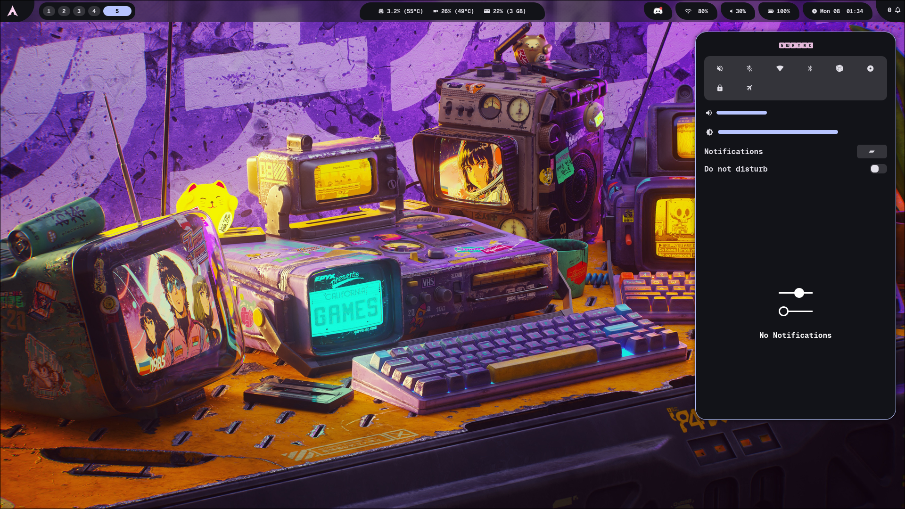

# ⚔️ Moonveil Dotfiles for Hyprland

## 🛠️ Installation
Note: The dotfiles are meant to run on my specific system, you will have to manually edit it for yours.

1. Run these commands.

- `sudo pacman -S firefox nautilus stow kitty waybar wofi swaync wlogout impala pavucontrol ttf-cascadia-code-nerd ttf-iosevka-nerd otf-geist-mono-nerd` 

- `yay -S matugen-bin`

- `sudo install -m 0440 /dev/stdin /etc/sudoers.d/bootwindows <<EOF $(whoami) ALL=(root) NOPASSWD: /usr/bin/efibootmgr, /usr/bin/reboot EOF`

2. Use `stow` to symlink config folders of programs to apply dotfiles.

For example, in the dotfiles directory, `stow waybar` to apply the config for waybar and `stow -D waybar` to remove it.

## 💡 Future Prospects
Implement matugen color pallete

## 📜 Credits
https://github.com/elifouts/Dotfiles

https://github.com/Abhra00/Matuprland

https://github.com/typecraft-dev/dotfiles

https://github.com/mylinuxforwork/dotfiles
